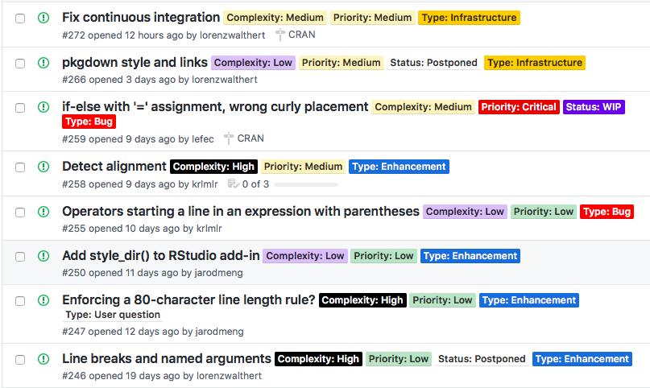

# Labelling Strategy

## Overview

This documentation outlines the labelling strategy that was used for dealing with issues. It was inspired by [this](https://medium.com/@dave_lunny/sane-github-labels-c5d2e6004b63) blog post. There are four types of categories used to label issues.

- Type
- Status
- Complexity
- Priority

That may then look like this. 

The colors of the labels were chosen such that dark / red corresponds to urgent / complex etc, whereas bright / green etc. corresponds to not urgent / simple and so on.

Labels should be assigned to issues as soon as possible.

In the next section, we will introduce every category in detail and descending order.

## Type

Type describes the type of the issue, it can be one of the following:

- Bug: Everything ranging from unexpected behavior to faulty behavior.
- Enhancement: An issue that relates to adding a feature to the project that 
  results in an API change.
- Infrastructure: Similar to Enhancement, but this refers to internal changes 
  and re-factoring, maintenance etc. rather than to API changes that affect the
  user experience.
- User Question: Questions from users that are not really any of the above, but
  rather just need clarification on the project.
- Unassigned: No type assigned yet.

## Status

Status describes the status of the issue, it can be one of the following:

- WIP: This is work in progress from some contributor and hence, it does not 
  make sense for other people to also work on it.
- Postponed: The issue was postponed, so it should not be expected to be 
  resolved in the near future. Reasons for an issue to get postponed might be 
  that the issue is blocked by some other issue or the lack
  of time (from the developers side) to resolve it quickly given that there are
  other (more urgent) issues.
  **Postponed issues are closed, even though they are not solved.**
- Unassigned: No status assigned yet.

## Priority

Priority describes the relevance of the issue, it can be one of the following:

- Critical: This issue is really pressing and affects the functionality of the
  project in a substantial fashion. It needs to be solved as soon as possible.
- High: Issue is urgent.
- Medium: Not so urgent.
- Low: This is a detail and does not affect the main functionality of the project.
- Unassigned: No priority assigned yet.

## Complexity

Complexity describes the complexity of the issue, it can be one of the following:

- High: Very complex issue that involves different aspects of the project that 
  need to be re-factored to solve the issue. Very time-consuming and difficult 
  to solve. Requires large background knowledge of the project.
- Medium: Might bear some complexity, time needed to solve this can be anticipated.
- Low: Almost trivial problem, can be resolved very quickly and without much 
  knowledge of the project.
- Unassigned: No complexity assigned yet.

## Meta

Meta describes meta aspects of the issue, it can be one of the following:

- Duplicate.
